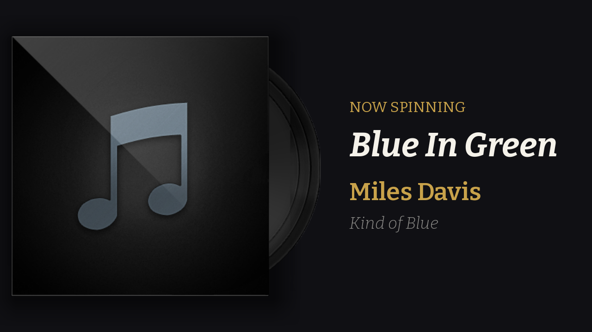

# now-spinning

A "now playing" screen for a record player.

Vinyl has no metadata stream — the only thing a turntable emits is sound. So
`now-spinning` listens. It runs on a Raspberry Pi mounted near the deck, hears the
music through a microphone, identifies it, and puts a spinning record on the
attached display with the track, artist, and album.



Two styles, set with `display.style`. **`sleeve`** (the default, shown above) puts
the cover in a record sleeve with the disc pulled halfway out and turning;
**`record`** puts it on the label of a turning platter. Both fall back to a
placeholder until the cover art has been fetched.

## How it works

```
mic ─▶ capture ─▶ music gate ─▶ 8s clip ─▶ Shazam ─▶ cover art
                                                        │
                                                   NowPlaying
                                                   ┌────┴────┐
                                              pygame       web
```

The engine only sends audio anywhere once it is confident music is actually
playing, and a match then buys a quiet period with no further lookups. That keeps
request volume low and stops one side of a record from generating dozens of calls.

The parts that make it usable next to a real turntable are all in the policy:

- **A missed match never blanks the screen.** Fingerprinting fails on worn
  pressings, long fades, and drum solos. The last known track stays up.
- **Quiet passages are not the end of the record.** Closing the gate takes 20
  seconds of sustained silence, with a lower threshold than opening it.
- **Side flips are expected.** After the music stops the display lingers for 90
  seconds before going idle.
- **Room noise is not music.** A level threshold alone would fire every time the
  furnace kicks on, so the gate also measures spectral flatness — noise is flat,
  music is peaky.

## Requirements

- **A 64-bit OS.** `shazamio-core` ships `manylinux_2_28_aarch64` wheels, so
  64-bit Raspberry Pi OS (Bookworm or later) installs with no Rust toolchain.
  32-bit `armv7l` has no wheel and is not supported.
- **Python 3.10–3.13.** On 3.13 an extra dependency (`audioop-lts`) is installed
  automatically, because a transitive dependency still imports the stdlib
  `audioop` module that 3.13 removed. Not 3.14: `shazamio-core` has no wheel for
  it yet.
- A Raspberry Pi 3 or newer (a Pi Zero 2 W works), a USB microphone, and a display.
- `libportaudio2` for microphone capture.

Any microphone PortAudio can open will do. Capture negotiates its format at
startup rather than demanding one, so a 16 kHz USB conference mic and a 96 kHz
audio interface both work with no configuration — it tries the configured rate,
then the device's own, then 48000, 44100, 32000, 24000, 22050, 16000, 96000,
88200, 20000, 11025 and 8000, and logs what it settled on. Mono and stereo inputs
are both fine; stereo is downmixed.

## Install

```bash
sudo apt install -y python3-venv libportaudio2
git clone https://github.com/untraceablez/now-spinning.git
cd now-spinning
python3 -m venv .venv
.venv/bin/pip install -e '.[all]'
```

Extras: `[pygame]` for the framebuffer display, `[web]` for the browser display,
`[all]` for both.

## Quickstart

Find the microphone:

```bash
now-spinning devices
```

Check the levels it actually sees, with a record playing:

```bash
now-spinning calibrate --device "USB Audio"
```

You want music to sit comfortably above `start_threshold_dbfs` and the room to
sit below `silence_threshold_dbfs`. Adjust in the config until `MUSIC` appears
when a record is on and `quiet` when it is not.

Confirm recognition works end to end before involving the display:

```bash
now-spinning identify --device "USB Audio"
```

Then run it:

```bash
now-spinning run --device "USB Audio"            # fullscreen record display
now-spinning run --backend web --port 8000       # browser display
now-spinning run --backend both                  # both at once
now-spinning run --demo --windowed               # no microphone, placeholder tracks
```

## Configuration

Copy `config.example.yaml` to `config.yaml` and change what you need — every key
has a working default, so the file only needs the overrides.

Searched in order:

1. `--config PATH`
2. `$XDG_CONFIG_HOME/now-spinning/config.yaml` (usually `~/.config/...`)
3. `~/.now-spinning.yaml`
4. **`config.yaml` in the working directory** — the checkout, or whatever the
   systemd unit's `WorkingDirectory` points at
5. `/etc/now-spinning/config.yaml`

On startup the log says which one it actually read, or lists everywhere it
looked if it found none:

```
INFO nowspinning: config: /home/pi/now-spinning/config.yaml
```

The keys worth knowing:

| Key | Default | What it does |
| --- | --- | --- |
| `audio.device` | system default | Device index, or a substring of its name so it survives renumbering |
| `audio.sample_rate` | `16000` | *Preferred* rate; capture negotiates down to one the device accepts |
| `audio.clip_seconds` | `8.0` | How much audio each lookup gets |
| `detect.start_threshold_dbfs` | `-45.0` | Level at which the gate opens |
| `detect.silence_threshold_dbfs` | `-50.0` | Level below which quiet starts counting |
| `detect.max_flatness` | `0.35` | Above this the input reads as noise, not music |
| `detect.silence_seconds` | `20.0` | Sustained quiet before the gate closes |
| `recognizer.quiet_period_seconds` | `60.0` | Lookup-free window after a fresh match |
| `recognizer.recheck_interval_seconds` | `45.0` | Cadence for catching track changes |
| `recognizer.linger_seconds` | `90.0` | How long the last track survives silence |
| `display.width` / `.height` | `0` | Render resolution; `0 x 0` uses the panel's native size |
| `display.backend` | `pygame` | `pygame`, `web`, `both`, or `none` |
| `display.style` | `sleeve` | `sleeve` (cover in a record sleeve) or `record` (cover on a spinning platter) |
| `display.show_vinyl` | `true` | Sleeve style: draw the turning record behind the cover |
| `display.show_gloss` | `true` | Sleeve style: lay the jacket's gloss over the cover |
| `display.show_shadow` | `true` | Sleeve style: cast a soft shadow under the cover |
| `display.shadow_offset_x` / `_y` | `0.008` / `0.016` | Shadow offset, as a fraction of the cover |
| `display.shadow_blur` / `_opacity` / `_color` | `0.5` / `0.5` / `#000000` | How soft, how dark, what colour |
| `display.show_heading` / `show_title` / `show_artist` / `show_album` | `true` | Which lines of text to show |
| `display.heading_text` | auto | Replace "Now spinning" with your own words |
| `display.background_mode` | `solid` | `solid`, or `artwork` for a blurred zoom of the cover |
| `display.background_blur` / `background_dim` | `0.75` / `0.55` | How far to blur and darken that background |
| `display.text_outline` | `false` | Outline the text — worth it over the artwork background |
| `display.text_outline_color` / `_width` | `#000000` / `2` | Outline colour, and its maximum thickness |
| `display.rpm` | `33.333` | Rotation speed — `45.0` for a single |
| `display.device_index` | system default | Which `/dev/dri/card` to draw on; needed for a GPIO/SPI panel, usually `1` |
| `fonts.source` | `google` | `google`, `local`, or `builtin` |
| `fonts.<role>.family` | `Bitter` | Family for `heading`, `title`, `artist`, `album` |
| `fonts.<role>.weight` | varies | `100`–`900`; `400` regular, `700` bold |
| `fonts.<role>.color` | theme | `#rrggbb` for that line only |

## Typography

Each line of text picks its own family, weight and slant, so one family can carry
the whole layout:

| Line | Default |
| --- | --- |
| `heading` — the "NOW SPINNING" label | Bitter Regular 400 |
| `title` — the track | Bitter Bold 700 Italic |
| `artist` | Bitter SemiBold 600 |
| `album` | Bitter Light 300 Italic |

`fonts.source` decides where the files come from:

- **`google`** (default) downloads each face from Google Fonts once and caches it
  under `$XDG_CACHE_HOME/now-spinning/fonts`. Only the first run needs the
  network, and if it cannot get there the display falls back to the built-in font
  rather than failing to start.
- **`local`** reads `.ttf`/`.otf` files out of `fonts.directory`, matched by
  family, weight and slant — `Bitter-BoldItalic.ttf` and `Bitter-700italic.ttf`
  both work, and subfolders are searched.
- **`builtin`** uses the font shipped with pygame and never touches the network.

Set `fonts.<role>.color` to give one line its own colour; leave it `null` to take
the colour from `display.foreground` / `display.accent`. `display.font_path`
still overrides every role at once, for setups that want a single face.

Rendering resolution is `display.width` / `display.height`. `0 x 0` — the default
— asks the panel what it is. Set both to pin a size, which is worth doing if a
panel misreports itself, or to render below native and save a little CPU.

## Small SPI displays

The cheap 3.5" 480×320 panels that sit on the GPIO header (ILI9486 — Waveshare
"RPi LCD 3.5", and the Inland/GoodTFT clones of it) work, but **not** via the
vendor's `LCD35-show` script. That script installs a legacy `fbtft` framebuffer
driver and edits `/boot/config.txt`, which moved to `/boot/firmware/config.txt`;
on a Pi 5 it typically leaves you with no display output at all. The `fbcp`
mirroring trick is also dead on Pi 5 — it used DispmanX, which that board removed.

Use the in-tree overlay's DRM mode instead. In `/boot/firmware/config.txt`:

```
dtoverlay=piscreen,drm,speed=16000000,fps=30
```

The `drm` flag is the important part: it binds the KMS/DRM `ili9486` driver
rather than `fbtft`, giving a real `/dev/dri/card*` node that SDL can render to.
Then point this program at that card:

```yaml
display:
  device_index: 1
  width: 480
  height: 320
```

There is usually more than one card (`vc4` for HDMI, `v3d` for the GPU, and the
panel), so check which index is the panel rather than assuming:

```bash
for c in /sys/class/drm/card?; do
  printf '%s -> %s\n' "$(basename "$c")" "$(basename "$(readlink -f "$c/device/driver")")"
done
```

**Do not add `rotate=90`.** The DRM driver's native mode is already 480×320
landscape, and `mipi_dbi_rotate_mode()` *swaps* width and height for 90 and 270 —
so `rotate=90` turns the panel portrait, which is the opposite of what the
parameter name suggests. Add it only if you actually want 320×480. (The
parameter reads the other way round for the legacy fbtft driver, which is where
the confusion comes from.)

**If the colours are wrong, suspect `speed` before anything else.** These panels
are driven over SPI with no error checking, so a clock the wiring cannot sustain
corrupts pixel data in transit. In RGB565 a few flipped bits move red into the
blue field, which looks convincingly like an RGB/BGR mismatch but is really
signal integrity. The overlay's own default is 24 MHz and not every board or
ribbon manages it — drop to `speed=16000000`, and lower again if needed. Suspect
a genuine colour-order problem only once a slower clock has been ruled out.

## Running as a service

```bash
sudo cp systemd/now-spinning.service /etc/systemd/system/
sudo systemctl edit now-spinning        # set User= and the config path if needed
sudo systemctl enable --now now-spinning
journalctl -u now-spinning -f
```

The unit sets `SDL_VIDEODRIVER=kmsdrm` so the display works on Raspberry Pi OS
Lite with no desktop environment. The service user needs to be in the `audio` and
`video` groups:

```bash
sudo usermod -aG audio,video "$USER"
```

## Troubleshooting

**No input device found.** `now-spinning devices` shows nothing → install
`libportaudio2`, confirm `arecord -l` sees the mic, and check group membership.

**`Package 'now-spinning' requires a different Python`.** Your `python3` is newer
than the supported range — most likely 3.14, since 3.13 is supported. Check with
`python3 --version`, then build the venv with an interpreter in range:
`sudo apt install python3.13-venv && python3.13 -m venv .venv`.

**`Invalid sample rate [PaErrorCode -9997]`.** The device runs at one fixed rate
(48 kHz on most USB interfaces) and PortAudio opens it through ALSA's raw device,
which does not resample. Capture negotiates this automatically — it tries the
configured rate, then the device's own, then a list of common ones — so if you
still see this, every format was refused. Check whether another program has the
device open, and try the other index the same interface exposes: ALSA usually
lists a card several times and only one entry is usable.

**Never matches anything.** Run `now-spinning identify` — it prints the captured
level. Below about −40 dBFS is too quiet; raise the gain in `alsamixer` or move
the mic closer to the speakers. Recognition is much better on the loud middle of a
track than on a fade-in.

**Matches, but the screen stays blank.** Check the backend: `--backend both` and
load `http://<pi>:8000` to see whether the problem is recognition or rendering.

**`pygame.error: kmsdrm not available`.** A desktop compositor (wayfire, labwc,
Xorg) already holds the DRM device, and SDL cannot take it while that is running.
This is the normal state on a Raspberry Pi OS *desktop* image, and SSHing in does
not change it. Boot to the console instead — `sudo raspi-config` → System Options
→ Boot / Auto Login → **Console Autologin** — which is what the systemd unit
expects. Running from inside the desktop session works too: the display falls
back to the `wayland` driver when `SDL_VIDEODRIVER` is not pinned.

**Black screen on a Pi with no desktop.** The service user needs `video` group
membership and access to `/dev/dri/card*`.

**Black screen on a GPIO/SPI panel.** A SPI panel is a *second* DRM device —
HDMI is `card0`, the panel is usually `card1` — and SDL takes `card0` unless told
otherwise, so it renders to the port nobody is looking at. Check `ls /dev/dri/`,
then set `display.device_index: 1`. See [Small SPI displays](#small-spi-displays).

**Gate never opens.** Run `calibrate`. If levels look right but the gate stays
shut, the input is probably failing the flatness test — raise `max_flatness`
toward `0.5`. The threshold does not need adjusting for a different sample rate:
flatness is measured over a fixed 50 Hz–8 kHz band precisely so that one setting
means the same thing on a 16 kHz mic and a 96 kHz interface.

## Development

```bash
uv venv && uv pip install -e '.[dev]'
pytest
ruff check . && mypy nowspinning
```

Tests use synthetic audio and recorded fixtures; nothing touches the network or a
sound card, so the suite runs anywhere.

Adding another recognition provider means implementing `Recognizer` in
`nowspinning/recognize/base.py` — two methods — and registering it in
`build_recognizer`. Nothing in the engine, the capture layer, or either renderer
needs to know.

## A note on Shazam

Recognition goes through [`shazamio`](https://github.com/shazamio/ShazamIO), an
**unofficial** client. It works well and needs no signup, but it is not a
supported API and could break without warning. This project is for personal use
next to your own turntable. If you need something contractual, ACRCloud and AudD
both sell proper APIs, and the `Recognizer` interface is there so you can drop one
in.

Not affiliated with, endorsed by, or sponsored by Apple Inc. or Shazam
Entertainment Ltd.

## Roadmap

- Additional recognition providers (ACRCloud, AudD)
- Optional scrobbling to Last.fm / ListenBrainz
- Discogs lookup for pressing details
- Play history and per-record statistics

## License

Apache License 2.0 — see [LICENSE](LICENSE).
